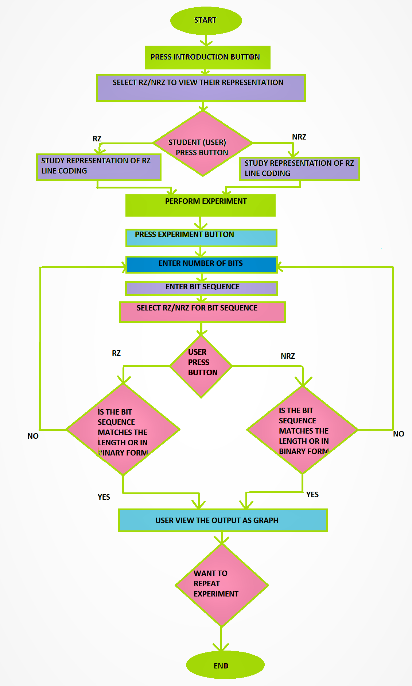
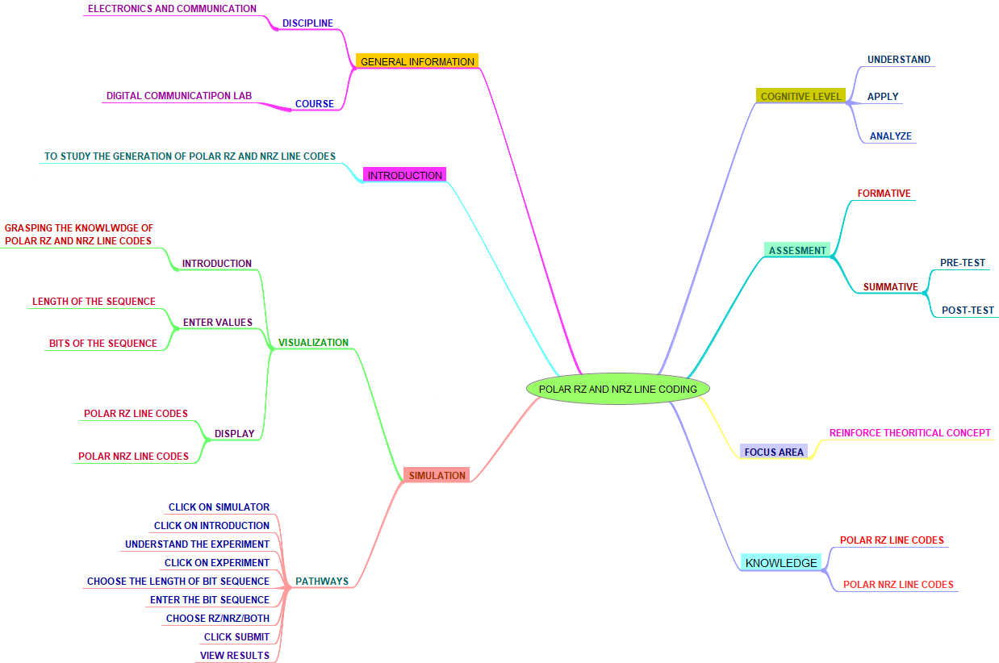

Experiment 1: To study the generation of Polar RZ and NRZ line codes.

### 1. Story Outline:

The experiment is to study the generation of the Polar RZ/NRZ line codes from the sequence given by the user. Student will learn the concept of ‘Line Coding and able to convert the binary data into Polar RZ/NRZ line codes and also able to compare between RZ and NRZ digital signal on the basis of their characteristics. In this experiment the simulator is designed in a way to give the Polar RZ/NRZ line codes on the basis of input entered by the User.

### 2. Story:

In this experiment ,we will obtain Polar RZ/NRZ  line codes. In Polar line coding scheme, positive voltage defines bit ‘1’and the negative voltage defines bit ‘0’. In RZ Polar line coding,signal return to zero at the middle of the bit whereas in NRZ Polar line code, signal does not return to zero at the middle of the bit.

In this experiment simulator will provide introduction to the user about Polar RZ and NRZ and produce line codes on the basis of  binary sequence provided by the user.The user is asked to enter the number of bits in the sequence and also is able to enter the bits of the sequence and then click on submit followed by choosing between RZ and NRZ or both. After the experiment the  end-user will be able to understand Polar RZ and NRZ line codes and also able to compare between RZ and NRZ digital Signals.

#### 2.1 Set the Visual Stage Description:

In this experiment the simulator starts with the window asking the user to click on the tab of introduction or experiment. Clicking on introduction the simulator will provide the conceptual knowledge of Polar RZ and NRZ line codes after that user will reach to the experiment part where user is asked to enter the length of the sequence and  the bits of the sequence. In any how, if the user does not enter binary digits or enter mismatch information the simulator will prompt an error after clicking the submit button, so the user needs to enter the information carefully. After that user can choose between RZ and NRZ or both and click on submit. Also if user click on submit button without entering the information the simulator will again show the error.

After submitting the information the simulator will convert the given binary sequence into the Polar RZ/NRZ as asked and will generate the graph showing Polar RZ/NRZ line codes.

#### 2.2 Set User Objectives & Goals:

1.To let user sense the real world systems and let them go through the practical systems by utilizing their theoretical knowledge. 
1.The end-user will be able to describe the concept of conversion of binary signal to a Polar RZ or NRZ digital signal (Line Coding). 
2.The end-user will be able to generate a Polar RZ and NRZ digital signal out of a binary sequence given. 
3.The end-user will be able to compare between Polar RZ and NRZ digital signal on the basis of their characteristics. 

#### 2.3 Set the Pathway Activities:

1.Click on simulator tab. 
2.Click on introduction tab. 
3.Understand the concept of Polar RZ and NRZ line codes. 
4.Click on done. 
5.Return to home screen. 
6.Click on Experiment. 
7.User need to enter the length of the sequence. 
8.User need to enter the binary sequence of chosen length. 
9.User can choose  RZ / NRZ or both line codes as depicted in simulator. 
10.User will click on submit button. 
11.Simulator will display Polar RZ/NRZ or both line codes. 

##### 2.4 Set Challenges and Questions/Complexity/Variations in Questions:

In the experiment the user will be asked questions based on cognitive levels. The question are as followed:-

Difficulty level:- Understand

1.In Polar RZ format for coding, symbol '0' is represented by:- 
 A. Amplitude of pulse is half 
 B. Negative Voltage 
 C. Pulse is transmitted for half the duration 
 D. All of the above 
 
 
Difficulty level:- Apply 
 
2.Convert binary sequence 1011 into Polar RZ line code. 

3.Convert binary sequence 1010 into Polar NRZ line code. 

Difficulty level:- Analyze

4. For a line code, the transmission bandwidth must be:- 
 A. Maximum possible 
 B. As small as possible 
 C. Depends on the signal 
 D. None of the above 
 
 
 

##### 2.5 Allow pitfalls:

There are some pitfalls in the simulator as follows: 

1.User need to enter the length of the sequence as asked by the simulator. 
2.User then have to fill the bits of the sequence in binary form ,if not the simulator will pop an error telling to, ”enter the valid sequence”. 
3.If the user leaves any field blank and click on submit button, the simulator will prompt the error to, “Kindly feed up the mandatory fields”. 
4.User need to enter the matching data in both the asked mandatory fields by the simulator, failing which will pop an error telling, “Sequence length and number of bits 	differ”. 

##### 2.6 Conclusion:

The user will able to learn the concept of Polar RZ/NRZ .This experiment will assist the user to inculcate the concept and apply them to convert the binary sequence into Polar RZ/NRZ line code. This will also help the user to verify whether the system is controllable and conspicuous or not. The end-user will be able to compare between Polar RZ and NRZ digital signal on the basis of their characteristics.

On general basis, this experiment will take short span of time to perform  and user can  have the clear idea of the experiment by understanding the concept of Polar RZ/NRZ by reading graph.

##### 2.7 Equations/formulas: NA
Formula for Polar RZ and NRZ line codes is :- 

<b> For Polar RZ: <b> 
      
If symbol 1 transmitted :-
      
      X(t) =     A/2     for 0 <= t <= Tb/2  (half interval) 
                   0     for Tb/2 <= t <= Tb (half interval) 
                          
  If symbol 0 transmitted :-  

      X(t) =     - A/2     for 0 <= t <= Tb/2  (half interval) 
                     0     for Tb/2 <= t <= Tb (half interval)  
      
<b> For Polar NRZ: <b> 
      
If symbol 1 transmitted :- 
      
      X(t) =    A/2     for 0 <= t <= Tb  
                                           
  If symbol 0 transmitted :-

      X(t) =  - A/2     for 0 <= t <= Tb 
      

### 3. Flowchart 4
 
link to flow chart Here : Store in the  /flowchart folder within Round2 folder in your repo
 
(guide :The lab proposer should extract logic from the story, prepare a flowchart from the story narration and write the algorithm to execute the black box.  use Google Drawings https://docs.google.com/drawings/ (send the link to your flowchart and also attach .png by exporting it )

### 4. Mindmap:

### 5. Storyboard :

